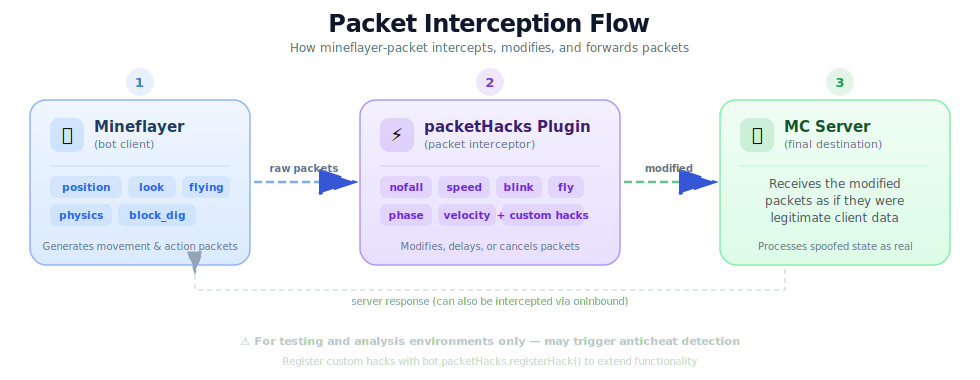
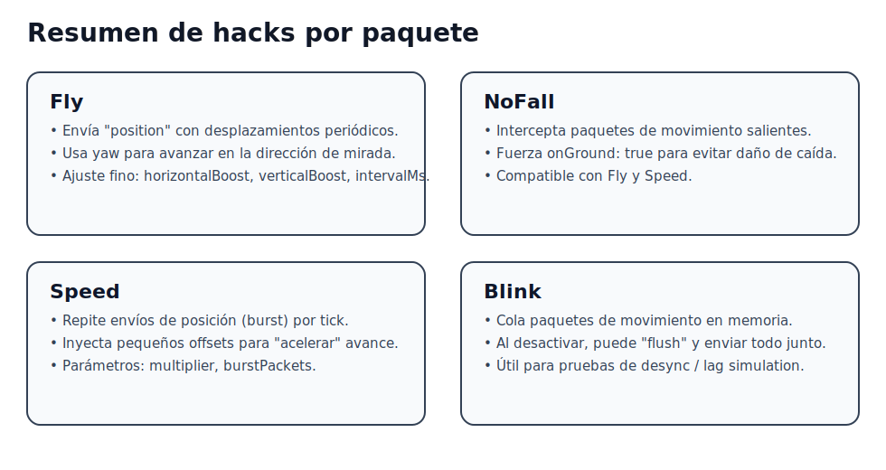

# mineflayer-packet

Mineflayer plugin for manipulating movement packets and enabling **fly**, **noFall**, **speed**, and **blink** modes.

> ⚠️ Use only in testing environments (private servers or lab setups).




## 1) Quick Installation

```bash
npm install mineflayer
```

Copy this repo into your project and load the plugin:

```js
const mineflayer = require('mineflayer')
const packetHacksPlugin = require('./src')

const bot = mineflayer.createBot({
  host: 'localhost',
  port: 25565,
  username: 'PacketBot'
})

bot.loadPlugin(packetHacksPlugin)
```

---

## 2) Plugin API

Once loaded, the plugin exposes `bot.packetHacks` with these methods:

| Method | Description |
|---|---|
| `enableFly(config)` | Starts packet-based flight |
| `disableFly()` | Stops flight mode |
| `enableNoFall()` | Activates fall damage prevention |
| `disableNoFall()` | Deactivates fall damage prevention |
| `enableSpeed(config)` | Enables speed boost via packet burst |
| `disableSpeed()` | Disables speed boost |
| `enableBlink(config)` | Starts queuing movement packets |
| `disableBlink({ flush })` | Stops blink, optionally flushes the queue |
| `flushBlinkQueue()` | Manually sends all queued packets |
| `status()` | Returns the current state of all hacks |

### `enableFly(config)` Options

| Parameter | Default | Description |
|---|---|---|
| `horizontalBoost` | `0.45` | Horizontal advance per fly tick |
| `verticalBoost` | `0.0` | Vertical push per tick |
| `intervalMs` | `50` | How often the position packet is sent (ms) |

### `enableSpeed(config)` Options

| Parameter | Default | Description |
|---|---|---|
| `multiplier` | `2.0` | How much to "accelerate" movement |
| `burstPackets` | `2` | Extra packets sent per movement tick |

### `enableBlink(config)` Options

| Parameter | Default | Description |
|---|---|---|
| `maxQueue` | `300` | Maximum packets held in queue |

---

## 3) Hack Examples

### 3.1 Fly

```js
bot.packetHacks.enableFly({
  horizontalBoost: 0.55,
  verticalBoost: 0.03,
  intervalMs: 50
})
```

- Higher `horizontalBoost` = faster forward speed.
- Positive `verticalBoost` = steady altitude gain.

To disable:

```js
bot.packetHacks.disableFly()
```

### 3.2 NoFall

```js
bot.packetHacks.enableNoFall()
```

This forces `onGround: true` on all outgoing movement packets, negating fall damage.

To disable:

```js
bot.packetHacks.disableNoFall()
```

### 3.3 Speed

```js
bot.packetHacks.enableSpeed({ multiplier: 2.5, burstPackets: 3 })
```

This injects extra position packets with small offsets in the look direction.

To disable:

```js
bot.packetHacks.disableSpeed()
```

### 3.4 Blink

```js
bot.packetHacks.enableBlink({ maxQueue: 200 })
```

While Blink is active, movement packets are queued in memory instead of being sent.

To disable and flush everything at once (teleport effect):

```js
bot.packetHacks.disableBlink({ flush: true })
```

To disable and discard the queue:

```js
bot.packetHacks.disableBlink({ flush: false })
```

---

## 4) Full Example Script

A ready-to-run script is available at:

- `examples/basic-usage.js`

Run it with:

```bash
node examples/basic-usage.js
```

In-game chat commands:

| Command | Action |
|---|---|
| `!fly on` | Enables fly mode |
| `!fly off` | Disables fly mode |
| `!nofall on` | Enables NoFall |
| `!speed on` | Enables speed boost |
| `!blink on` | Starts queuing packets |
| `!blink off` | Flushes queue and disables blink |
| `!hacks off` | Disables all hacks |
| `!status` | Prints current hack states |

---

## 5) How It Works Internally

1. **Saves** the original `bot._client.write` function.
2. **Overrides** `write` to intercept outgoing movement packets.
3. **Applies** the active hack logic:

   | Hack | Mechanism |
   |---|---|
   | **noFall** | Modifies the `onGround` field to `true` |
   | **speed** | Duplicates and injects extra position packets |
   | **blink** | Queues packets in memory, releases them on flush |
   | **fly** | Runs a `setInterval` loop pushing position updates |

4. **Restores** the original `write` function on bot `end` event.

---

## 6) Stability Tips

- **Don't** enable all hacks at maximum values simultaneously.
- **Gradually** adjust `intervalMs`, `multiplier`, and `burstPackets`.
- If the server runs anticheat, **start with low values** and increase carefully.
- Use `bot.packetHacks.status()` to **inspect internal state** at any time.

---

## 7) Project Structure

```
mineflayer-packet/
├── src/
│   ├── index.js            # Plugin entry point & loader
│   ├── fly.js              # Fly hack implementation
│   ├── nofall.js           # NoFall hack implementation
│   ├── speed.js            # Speed hack implementation
│   └── blink.js            # Blink hack implementation
├── examples/
│   └── basic-usage.js      # Ready-to-run demo script
├── docs/
│   └── assets/
│       ├── packet-flow.svg # Packet interception flow diagram
│       └── hacks-overview.svg # Hack summary diagram
├── package.json
└── README.md
```

---

<p align="center">
  <strong>⚠️ For testing and analysis purposes only.</strong><br>
  <em>Using this on public servers may violate server rules and result in bans.</em>
</p>
